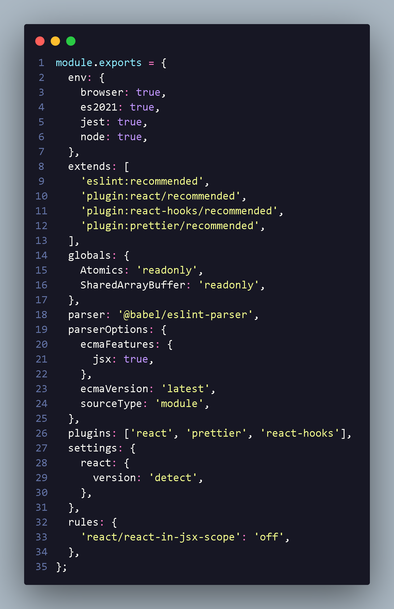

<h1 align="center"> Configurar o Eslint </h1>

<h3>Iniciando Eslint</h3>
<li>npx eslint --init</li>
<li>npm i -D prettier eslint-plugin-prettier eslint-config-prettier</li>
<li> Perguntas serao feitas
<li>to check syntax and find problems</li>
<li>Se irei utilizar qual import ou require</li>
<li>se usaremos framework React ou none of these </li>
<li> se vai utilizar Typescript </li>
<li>se codigo vai roda no node ou browser </li>
<li> qual formato  js</li>
<li>ele vai perguntar se quero baixar eslint plugin e eslint</li>

<li>apagar a linha eslint junto com package,node modules </li>

<h3> Eslint para react </h3>

          "editor.codeActionsOnSave": {
            "source.fixAll.eslint":true,
            "source.fixAll":true
          }

